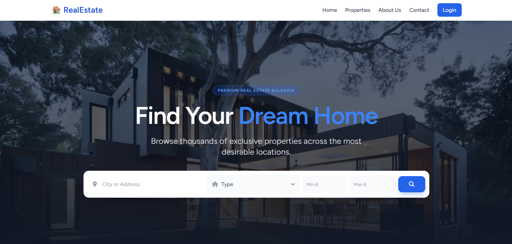

# 🏠 Real Estate Agency System

[]()
[]()
[]()
[]()
[](https://realestateagency-whs3.onrender.com/)

A full-stack **Laravel Real Estate Management Platform** designed for agencies to manage property listings, agents, clients, offers, property viewings, and internal workflows through a clean modern web interface.

---

## 🌐 Live Demo

🔗 **View Project Online:**  
https://realestateagency-whs3.onrender.com/

> Public demo hosted on Render with PostgreSQL database.

---

## 📌 Project Overview

This system was developed as a complete web solution for real estate agencies.  
It allows administrators and agents to manage listings, interact with clients, schedule viewings, receive offers, and organize property data efficiently.

The platform focuses on:

- Professional UI/UX
- Responsive design
- Role-based access
- Database-driven architecture
- Scalable Laravel structure

## ✨ Core Features

| Module | Features |
|--------|----------|
| 👤 Authentication | Secure login & registration, profiles, role-based access |
| 🏢 Properties | Add/edit/delete listings, images, types, regions |
| 🤝 Clients & Agents | Manage clients, agents, internal workflow |
| 💰 Offers | Submit offers, offer history, transactions |
| 📅 Viewings | Schedule and manage appointments |
| 📬 Communication | Contact inquiries and admin messages |
| 📊 Admin Panel | Reports, audit logs, dashboard tools |
| 📱 Responsive UI | Mobile-friendly layout, burger menu, optimized pages |

---

## 🛠 Tech Stack

| Technology | Usage |
|-----------|------|
| Laravel 12 | Backend Framework |
| PHP 8.2 | Server Language |
| PostgreSQL | Production Database |
| MySQL | Local Development |
| Blade | Templating Engine |
| Tailwind CSS | Styling |
| Alpine.js | Interactive UI |
| Docker | Containerized Deployment |
| Render | Cloud Hosting |

---

## 📸 Screenshots

## Homepage
```md
Add image here:

